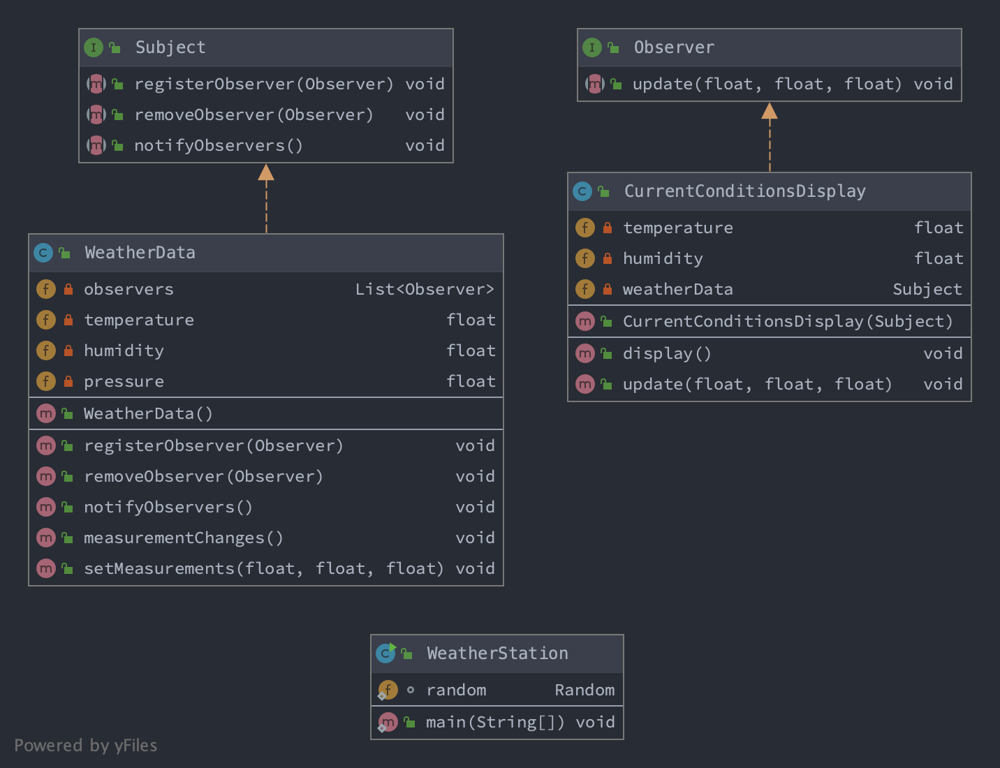

### 观察者模式

> 定义对象间的一种一对多的依赖关系，当一个对象的状态发生变化时，所有依赖于它的对象都得到通知

1. 依赖关系

多个观察者 `Observer Implements`            —依赖—>             数据对象 `Subject Implement`

     构造方法传参构造Subject成员变量，并将自己注册在Subject的观察者列表                              

```java
class ObserverImpl1 implements Observer{
	private Subject subject;
	public ObserverImpl1(Subject subject){
		this.subject = subject;
		//重要2
		this.subject.addObserver(this);
	}
}
```

2. 变化通知

数据对象变化 `Subject Implement`            —通知—>             多个观察者 

                `setXX()`                              `notifyObservers()`

3. Code Demo 
   
- 方法论

Subject 

```java
interface Subject{
	
	void addObserver(Observer observer);
	void removeObserver(Observer observer);
	void notifyObservers();

}
```

Subject Implement

```java
class DataSubject implements Subject{

	private List<Observer> observers;

	private Object data;

	public DataSubject(){
		observers = new ArrayList();
	}
	
	@Override
	void addObserver(Observer observer){
		observers.add(observer);
	}
	
	@Override
	void removeObserver(){

	}

	@Override
	void notifyObservers(){
		observers.stream()
			.filter(Objects::nonNull)
			.forEach(o -> o.update());
	}

	//重要1
	void setData(Object data){
		this.data = data;
		notifyObservers();
	}
	

}
```

Observer

```java
interface Observer{

	void update();	

}
```

Observer  Implements

```java
class ObserverImpl1 implements Observer{

	private Subject subject;

	public ObserverImpl1(Subject subject){
		this.subject = subject;
		//重要2
		this.subject.addObserver(this);
	}

	@Override
	public void update(){
		//...
	} 

}

class ObserverImpl2 implements Observer{

	private Subject subject;

	public ObserverImpl2(Subject subject){
		this.subject = subject;
		//重要2
		this.subject.addObserver(this);
	}

	@Override
	public void update(){
		//...
	} 

}
```
- 场景

气象站 -- 程序入口

气象站测得数据后，要显示在显示板上
```text
温度                当前状态显示板
湿度   ->  数据  ->  气相统计显示板
压强                简单预报显示板
```




4. Java原生

```text
java.util.Observable  -> Subejct
java.util.Observer    -> Observer
```

但是由于 `Observable` 是一个类，而Java是单继承的继承方式，耦合度太强，所以基本不建议使用